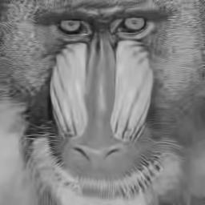

# CSC-364-Image-Processing-Final-Project
Python implementation of the BM3D image denoising algorithm (Dabov et al., 2007). Implements DCT/WHT transforms, block matching, 3D collaborative filtering with hard-thresholding and  Wiener filtering in two separate stages. Built for educational purposes to be presented at the [2026 Davidson College Verna Miller Case Symposium](VOTTA_BM3D48x36inchesAcademicPosterDavidson.pdf) 

## Required Packages:

```pip install Pillow```

```pip install numpy```

> *Math and Random are standard python libraries. Pillow is for working with image pixels and numpy is for efficiency purposes.*

## Important Files:

[AWGN.py](AWGN.py) applies additive white gaussian noise to any image

[bm3d_pure.py](bm3d_pure.py) from-scratch implementation of algorithm (SLOW!!!!)

[bm3d_efficient.py](bm3d_efficient.py) adds numpy and multi parellel programming for practicality


## Algorithm Overview:

The **Block Matching and 3D filtering** (BM3D) algorithm works in two stages: **first**, it groups mathematically similar image blocks (8x8 pixels default) into 3D groups, applies a separable 3D transform (2D discrete cosine + Walsh-Hadamard), and suppresses noisey pixels through hard thresholding to produce a basic estimate image. **second**, it refines that estimate using Wiener filtering for a more denoised final result. A pure python implementation with explainatory documentation and formulas is written to make every step of the algorithm transparent and approachable for educational purposes. It was built as my final project for my CSC-364 Image Processing class.


## Features:

- This project can be appllied to any gray-scale jpeg image
- User can toggle sigma values, block sizes, hard threshold multipliers/values, and stepping values to optimize denoising results
- User will be prompted for an jpg image file and a sigma value
- Block size, allowed dissimilarity, hard thresholding values, and step sizes can be toggled in bm3d files  
- Noisy and denoised images will be audimatically saved in dirrectory as {file_name.jpg}_noisy{sigma value}.jpg and {file_name.jpg}_denoised{sigma value}.jpg


# How to use:

*I would love to add a front end to this project in the future, but for now, everything happens in the terminal:*

 - once repo folder is downloaded, user can add any images they want to it, or use the ones already in the repo

 - in the terminal, ensure python3 in installed then run
 ```python3 bm3d_efficient.py```

 - note: bm3d_pure.py was never intended to be run. without the help of the GPU or parellel programming, it is extremely slow. It has a run time of O((MN)^2W^2B^3/S^2) where MN is the number of pixels for the width and height of the image, W is the search window for finding simmilar blocks, B is block size, and S is block side length.

 - The terminal will prompt the user for a file within the folder, a sigma value, and whether or not they'd like to apply AWGN to the image first before denoising:

```Input an image: ```\
```Input a sigma value (must be float): ```\
```would you like to add additive white gaussian noise (AWGN) to your image first? (yes/no): ```\

 - lets run through an example. I will start by inputting [mandrill.jpg](mandrill.jpg) to the terminal:

 ```Input an image: mandrill.jpg```

 

 - I will then input a sigma value 25.

 ```Input a sigma value (must be float): ```

 - I could just denoise this image dirrectly if it already have alot of AWGN, but it doesn't, so I will opt to add noise to see a notible difference before and after the algorithm works. 

 - ```would you like to add additive white gaussian noise (AWGN) to your image first? (yes/no): yes```

 - I will first get an image saved in the folder called [mandril_noisy_25.jpg](noisy_mandrill_25.jpg)

 

 - Then I will get the denoised product, [mandril_denoised_25.jpg](denoised_mandrill_25.jpg)




 - if any of the above prompts do not get back their expected values, the user will be prompted to try again.


## Feedback and Contributing

Feel free to add feedback to my work or suggest changes on the repositorie's [discussion board](https://github.com/rovotta/CSC-364-Image-Processing-Final-Project/discussions)


