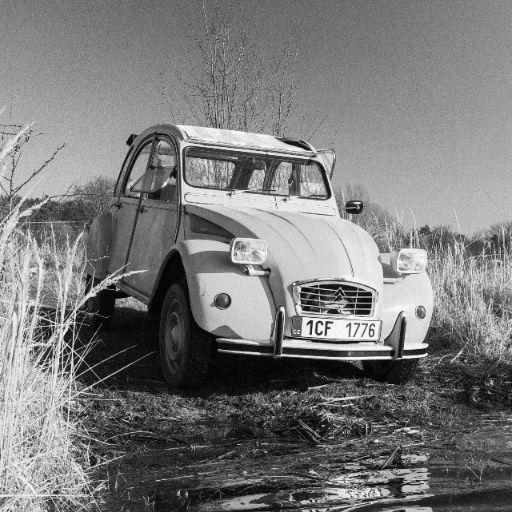
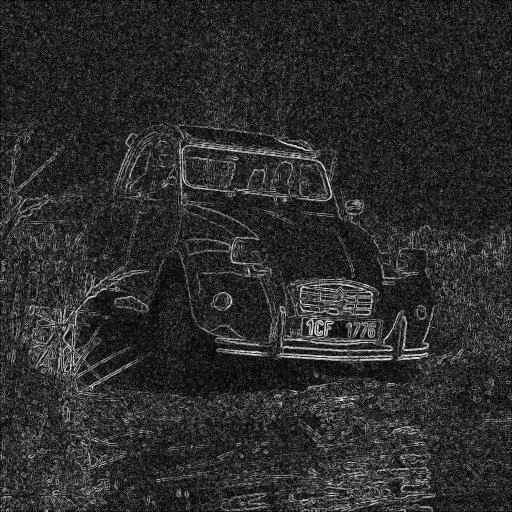
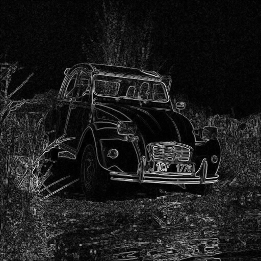

# CSC-364-Image-Processing-Final-Project
Python implementation of the BM3D image denoising algorithm (Dabov et al., 2007). Implements DCT/WHT transforms, block matching, 3D collaborative filtering with hard-thresholding and  Wiener filtering in two separate stages. Built for educational purposes to be presented at the [2026 Davidson College Verna Miller Case Symposium](VOTTA_BM3D48x36inchesAcademicPosterDavidson.pdf) 

## Required Packages:

```pip install Pillow```

```pip install numpy```

> *Math and Random are standard python libraries. Pillow is for working with image pixels and numpy is for efficiency purposes.*
## additional Packages:

 ```import numpy as np```
 
```from scipy.fft import dct, idct, dctn, idctn```

 ```from scipy.linalg import hadamard```
> numpy allows for all pixels to be operated on at once. dramatically increased runtime, scipy imports are all the transforms we need coded in C for increased speed.

## Important Files:

[AWGN.py](AWGN.py) applies additive white gaussian noise to any image

[bm3d_pure.py](bm3d_pure.py) from-scratch implementation of algorithm (SLOW!!!!)

[bm3d_efficient.py](bm3d_efficient.py) adds numpy and multi parallel programming for practicality


## Algorithm Overview:

The **Block Matching and 3D filtering** (BM3D) algorithm works in two stages: **first**, it groups mathematically similar image blocks (8x8 pixels default) into 3D groups, applies a separable 3D transform (2D discrete cosine + Walsh-Hadamard), and suppresses noisy pixels through hard thresholding to produce a basic estimate image. **second**, it refines that estimate using Wiener filtering for a more denoised final result. A pure python implementation with explanatory documentation and formulas is written to make every step of the algorithm transparent and approachable for educational purposes. It was built as my final project for my CSC-364 Image Processing class. You can learn more about the algorithm in [Image Denoising and Collaborative Filtering](BM3D_TIP_2007.pdf)


## Features:

- This implementation can be applied to any gray-scale jpeg image
- you can also input RGB images, but they will be converted to gray-scale through the program and the outputs will be gray scale
- User will be prompted for a jpg image file and a sigma value for the gaussian curve
- Noisy and denoised images will be automatically saved in directory as {file_name.jpg}_noisy{sigma value}.jpg and {file_name.jpg}_denoised{sigma value}.jpg
-  below is all the global variables the user can toggle within the bm3d python files:
-  For a 512x512 pixel image, I could get the algorithm to run between 3 and 4 minutes on bm3d_efficent and 3 hours for bm3d_pure


 __BLOCK_SIZE_1__ -  Side length (number of pixels) of each patch in Stage 1
 
 __MAX_GROUP_SIZE_1__ - Max number of similar blocks per 3D group in Stage 1
 
 __TAU_MATCH_1__ - Max allowed dissimilarity between blocks in Stage 1
 
 __STEP_1__ - Sliding step between reference blocks in Stage 1
 
 __BLOCK_SIZE_2__  - Side length (number of pixels) of each patch in Stage 2   
 
 __MAX_GROUP_SIZE_2__ - Max number of similar blocks per 3D group in Stage 2    
 
 __TAU_MATCH_2__  - Max allowed dissimilarity between blocks in Stage 2
 
 __STEP_2__ - Sliding step between reference blocks in Stage 2                  
 
 __SEARCH_WIN__ - Side length (number of pixels) of the search window used to find similar blocks       
 
 __LAMBDA_HT__ - Hard-threshold multiplier — scales the threshold applied in Stage 1        
 
 __LAMBDA_DIST__  - Pre-filter threshold multiplier for block distance in Stage 1           

 

# How to use:

*I would love to add a front end to this project in the future, but for now, everything happens in the terminal:*

 - once repo folder is downloaded, the user can add any images they have downloaded to it, or they use the ones already in the repo

 - in the terminal, ensure python3 in installed then run
 ```python3 bm3d_efficient.py```

 - note: bm3d_pure.py was never intended to be run. without the help of the GPU or parellel programming, it is extremely slow. It has a run time of $$O((MN)^2W^2\frac{B^3}{S^2})$$ where MN is the number of pixels for the width and height of the image, W is the search window for finding similar blocks, B is block size, and S the steping amount.

 - The terminal will prompt the user for a file within the folder, a sigma value, and whether or not they'd like to apply AWGN to the image first before denoising:

```Input an image: ```\
```Input a sigma value (must be float): ```\
```would you like to add additive white gaussian noise (AWGN) to your image first? (yes/no): ```\

 - lets run through an example. I will start by inputting [mandrill.jpg](mandrill.jpg) to the terminal:

 ```Input an image: mandrill.jpg```

 

 - I will then input a sigma value 25.

```Input a sigma value (must be float): 25```

 - I could just denoise this image directly if it already have a lot of AWGN, but it doesn't, so I will opt to add noise to see a notable difference before and after the algorithm works. 

```would you like to add additive white gaussian noise (AWGN) to your image first? (yes/no): yes```

 - I will first get an image saved in the folder called [mandril_noisy_25.0.jpg](noisy_mandrill_25.jpg)

 

 - Then I will get the denoised product, [mandril_denoised_25.jpg](denoised_mandrill_25.0.jpg)


 - if any of the above prompts do not get back their expected values, the user will be prompted to try again.

## Applications

One of the most important applications of the program are it's uses in edge detection. Many Edge detection algorthms apply a small
guassian blur to limit some noise, but for images with an immense amount of noise, our BM3D can make a huge difference.

 - let's take this image of a citroen 2CV:



 - now let's say this image was corrupted, but we want to detect the car with canny edge detection:


 - using a canny edge strength filter, you can see it's hard to make out the car:



- denoising and then runing the exact same edge detection filter, we can see the edges come out alot cleaner:



- there are alot of real-world implications for this in medical imaging, machine learning, and image forensics

## Feedback and Contributing

Thankyou for reading! Feel free to add feedback to my work or suggest changes on the repository's [discussion board](https://github.com/rovotta/CSC-364-Image-Processing-Final-Project/discussions)

## Citations:

Dabov, K., Foi, A., Katkovnik, V., \& Egiazarian, K. (2007). Image denoising by sparse 3-D transform-domain collaborative filtering.*IEEE Transactions on Image Processing, 16*(8), 2080--2095.


Hambretch, F. (2013). 2.4 BM3D for Image Denoising | Image Analysis Class 2013. Retrieved from https://www.youtube.com/watch?v=BlDl6M0go-c


